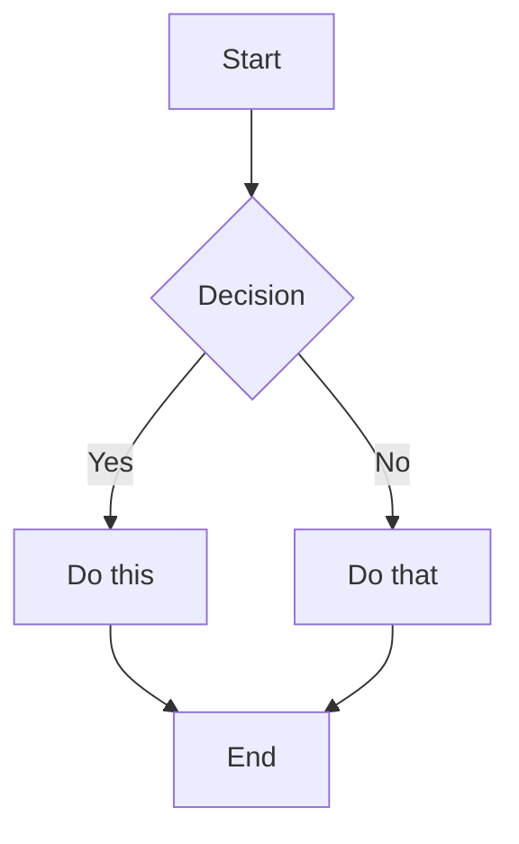
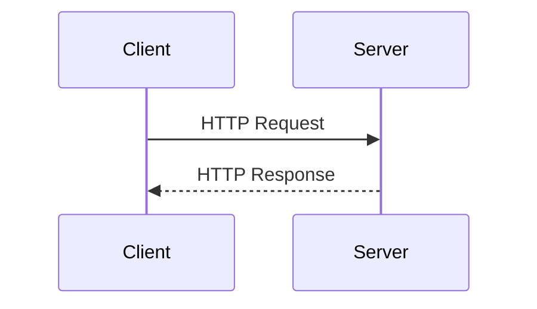
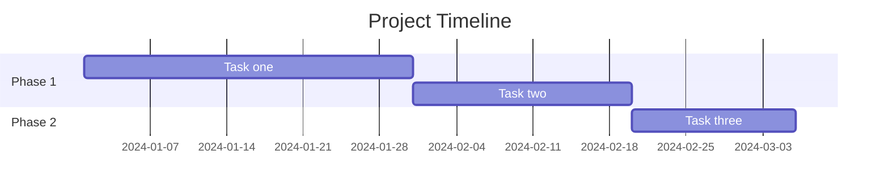
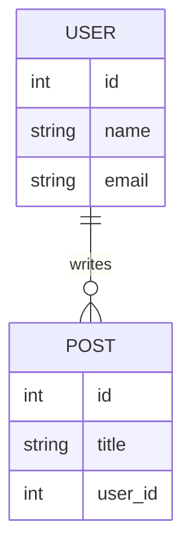
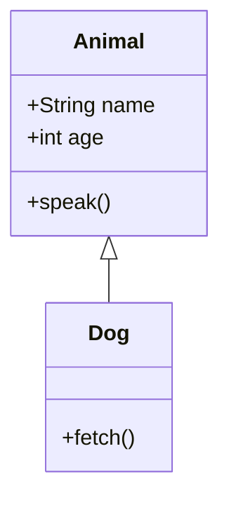

# Markdown Complete Reference

Markdown is a lightweight markup language created by John Gruber in 2004. It converts plain text into HTML and is the standard for README files, documentation, and technical writing. This document covers every element of CommonMark and GitHub Flavored Markdown (GFM).

---

## Table of Contents

- [Headings](#headings)
- [Paragraphs and Line Breaks](#paragraphs-and-line-breaks)
- [Emphasis](#emphasis)
- [Blockquotes](#blockquotes)
- [Lists](#lists)
- [Code](#code)
- [Horizontal Rules](#horizontal-rules)
- [Links](#links)
- [Images](#images)
- [Tables](#tables)
- [Task Lists](#task-lists)
- [Footnotes](#footnotes)
- [Definition Lists](#definition-lists)
- [Strikethrough](#strikethrough)
- [Subscript and Superscript](#subscript-and-superscript)
- [HTML in Markdown](#html-in-markdown)
- [Escaping Characters](#escaping-characters)
- [Diagrams with Mermaid](#diagrams-with-mermaid)
- [Math with LaTeX](#math-with-latex)
- [Badges](#badges)
- [Collapsible Sections](#collapsible-sections)
- [README Best Practices](#readme-best-practices)
- [Markdown Flavors](#markdown-flavors)

---

## Headings

Headings are created with the `#` symbol. There are six levels. Each level maps to an HTML heading tag from `<h1>` to `<h6>`.

```markdown
# Heading 1
## Heading 2
### Heading 3
#### Heading 4
##### Heading 5
###### Heading 6
```

Alternative syntax using underlines applies only to H1 and H2:

```markdown
Heading 1
=========

Heading 2
---------
```

Rules:
- Always place a space between `#` and the text.
- Heading 1 should appear only once per document, typically as the document title.
- Headings generate anchor links automatically on GitHub, used for navigation.

---

## Paragraphs and Line Breaks

A paragraph is one or more lines of text separated by a blank line.

```markdown
This is the first paragraph.

This is the second paragraph.
```

To create a line break within a paragraph without starting a new one, end the line with two or more spaces, or use a backslash at the end of the line.

```markdown
Line one  
Line two (preceded by two trailing spaces)

Line one\
Line two (preceded by a backslash)
```

Rules:
- Never indent paragraphs with spaces or tabs unless inside a list or blockquote.
- Blank lines between blocks are mandatory for correct parsing.

---

## Emphasis

```markdown
*italic*
_italic_

**bold**
__bold__

***bold and italic***
___bold and italic___

**bold and _nested italic_**
```

Renders as:

*italic* | **bold** | ***bold and italic*** | **bold and _nested italic_**

Rules:
- Asterisks (`*`) are preferred over underscores (`_`) for compatibility.
- Underscores inside words are not treated as emphasis in CommonMark: `some_variable_name` renders literally.

---

## Blockquotes

```markdown
> This is a blockquote.

> This is a multi-line blockquote.
> It continues on the next line.

> Nested level one.
>> Nested level two.
>>> Nested level three.
```

Blockquotes can contain any Markdown element:

```markdown
> ### Heading inside a blockquote
>
> - List item
> - Another item
>
> **Bold text** inside a blockquote.
```

---

## Lists

### Unordered Lists

Use `-`, `*`, or `+` as list markers. Consistency within a list is recommended.

```markdown
- Item one
- Item two
- Item three

* Item one
* Item two

+ Item one
+ Item two
```

### Ordered Lists

```markdown
1. First item
2. Second item
3. Third item
```

The numbers do not need to be sequential. Markdown will render them in order regardless:

```markdown
1. First item
1. Second item
1. Third item
```

### Nested Lists

Indent with four spaces or one tab to create sublists:

```markdown
- Item one
    - Sub-item one
    - Sub-item two
        - Sub-sub-item
- Item two
```

### Lists with Paragraphs

To include multiple paragraphs in a list item, indent subsequent paragraphs with four spaces:

```markdown
- First item

    This paragraph belongs to the first item.

- Second item
```

---

## Code

### Inline Code

Wrap text with single backticks:

```markdown
Use the `printf()` function.
```

Renders as: Use the `printf()` function.

To include a backtick inside inline code, use double backticks:

```markdown
`` Use `backticks` inside inline code ``
```

### Fenced Code Blocks

Use triple backticks or triple tildes to create a code block. Optionally specify a language for syntax highlighting.

````markdown
```python
def hello_world():
    print("Hello, World!")
```
````

````markdown
```javascript
const greet = (name) => `Hello, ${name}`;
```
````

````markdown
```bash
git clone https://github.com/user/repo.git
cd repo
npm install
```
````

````markdown
```json
{
  "name": "project",
  "version": "1.0.0",
  "description": "A sample project"
}
```
````

````markdown
```sql
SELECT id, name, email
FROM users
WHERE active = true
ORDER BY name ASC;
```
````

### Indented Code Blocks (legacy)

Indent lines with four spaces. Fenced blocks are preferred.

```markdown
    This is a code block
    via indentation
```

---

## Horizontal Rules

Three or more hyphens, asterisks, or underscores on a line by themselves:

```markdown
---

***

___
```

All three render identically as a horizontal divider.

---

## Links

### Inline Links

```markdown
[Link text](https://example.com)
[Link text](https://example.com "Optional title on hover")
```

### Reference Links

Useful for reusing URLs or keeping text readable:

```markdown
[Link text][reference-id]

[reference-id]: https://example.com "Optional title"
```

### Automatic Links

Angle brackets convert a URL or email into a clickable link:

```markdown
<https://example.com>
<user@example.com>
```

### Relative Links

Used to link to files within the same repository:

```markdown
[See the contributing guide](CONTRIBUTING.md)
[Go to the docs folder](docs/guide.md)
[Back to top](#table-of-contents)
```

### Anchor Links

GitHub generates anchors from headings automatically. Rules for generating the anchor:
- Convert to lowercase
- Replace spaces with hyphens
- Remove all punctuation except hyphens

```markdown
[Jump to Code section](#code)
[Jump to Lists](#lists)
```

---

## Images

```markdown


```

Reference syntax:

```markdown
![Alt text][image-ref]

[image-ref]: https://example.com/image.png "Optional title"
```

Relative path to a file in the repository:

```markdown


```

Images inside links:

```markdown
[](https://example.com)
```

Controlling image size requires HTML (see HTML in Markdown section):

```html

```

---

## Tables

Tables are a GitHub Flavored Markdown (GFM) extension.

```markdown
| Column 1 | Column 2 | Column 3 |
| -------- | -------- | -------- |
| Cell     | Cell     | Cell     |
| Cell     | Cell     | Cell     |
```

### Column Alignment

```markdown
| Left-aligned | Center-aligned | Right-aligned |
| :----------- | :------------: | ------------: |
| Text         |     Text       |          Text |
| Text         |     Text       |          Text |
```

- `:---` aligns left
- `:---:` aligns center
- `---:` aligns right

Rules:
- The header separator row (dashes) is mandatory.
- Pipes at the outer edges are optional but recommended for readability.
- Cells do not need to be padded to align visually — the renderer handles it.
- Tables cannot contain block elements such as code blocks or lists.

---

## Task Lists

Task lists are a GFM extension. They render as interactive checkboxes on GitHub.

```markdown
- [x] Completed task
- [ ] Incomplete task
- [x] Another completed task
- [ ] Another incomplete task
```

Nested task lists:

```markdown
- [x] Main task
    - [x] Sub-task one
    - [ ] Sub-task two
```

---

## Footnotes

Footnotes are supported in GFM and some renderers.

```markdown
This is a sentence with a footnote.[^1]

Another sentence with a different footnote.[^note]

[^1]: This is the footnote content.
[^note]: Footnotes can contain **Markdown** formatting.
```

Footnotes render at the bottom of the document regardless of where they are defined.

---

## Definition Lists

Supported in some Markdown processors (Pandoc, MultiMarkdown, kramdown):

```markdown
Term
: Definition of the term.

Another Term
: First definition.
: Second definition.
```

Not supported in standard CommonMark or GFM.

---

## Strikethrough

A GFM extension. Wrap text with double tildes:

```markdown
~~This text is struck through.~~
```

Renders as: ~~This text is struck through.~~

---

## Subscript and Superscript

Not part of CommonMark or GFM. Supported in Pandoc and some extended processors.

```markdown
H~2~O        (subscript)
X^2^         (superscript)
```

In HTML-supporting renderers:

```html
H<sub>2</sub>O
X<sup>2</sup>
```

---

## HTML in Markdown

Most Markdown processors allow raw HTML inline or as blocks.

### Common uses

Controlling image dimensions:

```html

```

Centering content:

```html
<div align="center">
  
  <h1>Project Name</h1>
  <p>A short description of the project.</p>
</div>
```

Line breaks:

```html
Line one<br>Line two
```

Keyboard keys:

```html
Press <kbd>Ctrl</kbd> + <kbd>C</kbd> to copy.
```

Highlighting:

```html
<mark>Highlighted text</mark>
```

Rules:
- Block-level HTML must be separated from surrounding Markdown with blank lines.
- Markdown syntax inside raw HTML blocks is not processed.
- Some HTML is stripped by renderers for security (GitHub sanitizes certain tags).

---

## Escaping Characters

To display a character that would otherwise be interpreted as Markdown syntax, prefix it with a backslash.

```markdown
\*Not italic\*
\# Not a heading
\[Not a link\]
\`Not inline code\`
\\ A literal backslash
```

Characters that can be escaped:

```
\ ` * _ { } [ ] < > ( ) # + - . ! |
```

---

## Diagrams with Mermaid

GitHub natively renders Mermaid diagrams inside fenced code blocks with the `mermaid` language tag.

### Flowchart

````markdown

````

### Sequence Diagram

````markdown

````

### Gantt Chart

````markdown

````

### Entity Relationship Diagram

````markdown

````

### Class Diagram

````markdown

````

---

## Math with LaTeX

GitHub supports LaTeX math notation using `$` for inline and `$$` for block expressions.

Inline math:

```markdown
The quadratic formula is $x = \frac{-b \pm \sqrt{b^2 - 4ac}}{2a}$.
```

Block math:

```markdown
$$
\sum_{i=1}^{n} i = \frac{n(n+1)}{2}
$$
```

```markdown
$$
E = mc^2
$$
```

```markdown
$$
\int_0^\infty e^{-x^2} dx = \frac{\sqrt{\pi}}{2}
$$
```

---

## Badges

Badges are images generated by services like shields.io. They are used in README files to display build status, version, license, and other metadata.

```markdown


```

Badges as links:

```markdown
[](LICENSE)
[](https://www.npmjs.com/package/package-name)
```

Custom badge syntax on shields.io:

```
https://img.shields.io/badge/<LABEL>-<MESSAGE>-<COLOR>
```

```markdown


```

---

## Collapsible Sections

GitHub renders `<details>` and `<summary>` HTML tags as collapsible sections.

```markdown
<details>
<summary>Click to expand</summary>

Content inside the collapsible section.

- List item
- Another item

```code block inside collapsible```

</details>
```

Open by default:

```markdown
<details open>
<summary>This section starts expanded</summary>

Content here is visible by default.

</details>
```

Rules:
- Leave a blank line after `<summary>` to allow Markdown inside `<details>` to render correctly.
- Nesting multiple `<details>` blocks is supported.

---

## README Best Practices

A README is the front page of a project. It should communicate what the project is, how to use it, and how to contribute.

### Recommended structure

```markdown
# Project Name

Short description — one to two sentences explaining what this project does and who it is for.

## Features

- Feature one
- Feature two
- Feature three

## Requirements

- Node.js 18 or higher
- npm 9 or higher

## Installation

```bash
git clone https://github.com/user/project.git
cd project
npm install
```

## Usage

```bash
npm start
```

Describe the most common usage patterns here.

## Configuration

| Variable        | Default | Description               |
| --------------- | ------- | ------------------------- |
| `PORT`          | `3000`  | Server port               |
| `DATABASE_URL`  | —       | Connection string          |

## API Reference

Document endpoints, functions, or commands here.

## Contributing

1. Fork the repository
2. Create a branch: `git checkout -b feature/name`
3. Commit your changes: `git commit -m "Add feature"`
4. Push to the branch: `git push origin feature/name`
5. Open a pull request

## License

[MIT](LICENSE)
```

### Rules

- Keep the title as H1 and use it only once.
- Place the most important information first.
- Include working installation instructions. Test them.
- Use code blocks for every command, path, and code snippet.
- Tables are better than lists for configuration options with multiple attributes.
- Link to a LICENSE file rather than pasting license text.
- Keep the README updated as the project evolves.

---

## Markdown Flavors

Different tools and platforms implement different versions of Markdown. Understanding which flavor is in use is essential for compatibility.

| Flavor | Used by | Notable extensions |
| ------ | ------- | ------------------ |
| CommonMark | Standard base | None (base spec) |
| GitHub Flavored Markdown (GFM) | GitHub, GitLab | Tables, task lists, strikethrough, autolinks |
| MultiMarkdown | Pandoc, some editors | Footnotes, definition lists, tables, metadata |
| kramdown | Jekyll, GitHub Pages | Attributes, footnotes, math |
| Pandoc Markdown | Pandoc | Most extensive, nearly all extensions |
| R Markdown | RStudio | Code execution, embedded R output |
| MDX | Next.js, Docusaurus | JSX inside Markdown |

### CommonMark

The official specification at [commonmark.org](https://commonmark.org). Defines precise rules for parsing ambiguous syntax. Most modern renderers are CommonMark-compliant.

### GitHub Flavored Markdown (GFM)

A superset of CommonMark. Adds:
- Tables
- Task lists
- Strikethrough with `~~`
- Autolinks for URLs without angle brackets
- Disallows raw HTML in some contexts for security

Specification: [github.github.com/gfm](https://github.github.com/gfm/)

---

## Quick Reference

```markdown
# H1  ## H2  ### H3  #### H4  ##### H5  ###### H6

*italic*  **bold**  ***bold italic***  ~~strikethrough~~

> Blockquote

- Unordered item
1. Ordered item
- [x] Task done
- [ ] Task pending

`inline code`

```language
code block
```

[Link text](url)


| Col 1 | Col 2 |
| ----- | ----- |
| Cell  | Cell  |

---  (horizontal rule)

[^1]  (footnote reference)
[^1]: Footnote text

<details><summary>Title</summary>Content</details>

$inline math$
$$block math$$
```

---

*This reference covers CommonMark and GitHub Flavored Markdown. For platform-specific behavior, consult the documentation of your renderer.*
